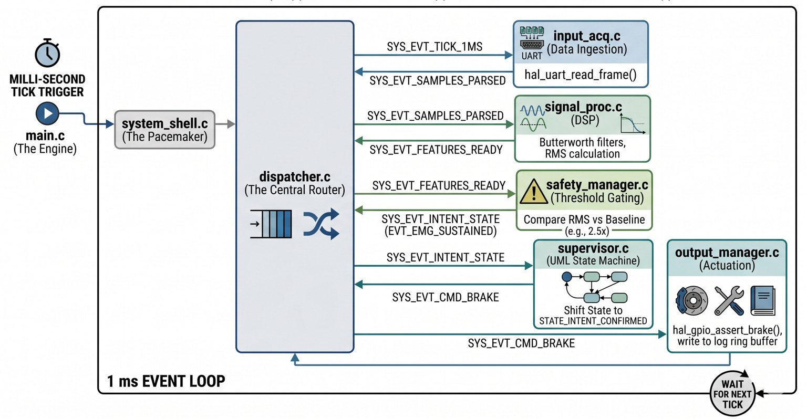

Here is the updated `README.md` file reflecting your new Time-Triggered Event-Driven Architecture. You can copy the raw text below directly into your project.

```markdown
# EMG-EDA Brake Intent Detection (Event-Driven Architecture)

An embedded safety subsystem that detects **emergency braking intent** using calf muscle EMG (and optional EDA) signals and triggers an emergency brake request. Built as a redundant, safety-oriented intent detection channel for driver assistance.

> **Course:** CS G523 — Software for Embedded Systems

---

## Architecture

The firmware has been upgraded from a polled superloop to a **Time-Triggered Event-Driven Architecture (EDA)**. Modules are completely decoupled and communicate strictly via message-passing through a central Dispatcher Queue. 

Execution is driven by a 1 ms hardware interrupt, which triggers a cascade of data-driven events:

```text
[1ms Hardware Tick] ──► Dispatcher (Ring Buffer Queue)
                             │
       ┌─────────────────────┼─────────────────────┐
       ▼                     ▼                     ▼
 [Input Acq]          [Signal Proc]         [Safety Manager]
 Parses UART ───────► Extracts RMS ───────► Checks Threshold
 (Push Samples)       (Push Features)       (Push Intent)
                                                   │
       ┌───────────────────────────────────────────┘
       ▼
  [Supervisor]
  UML Statechart ───► [Output Manager]
  (Push Cmd)          Asserts Brake GPIO
```

## Working overview



### Core Event Chain
1. `SYS_EVT_TICK_1MS` → Prompts Input to check the UART hardware buffer.
2. `SYS_EVT_SAMPLES_PARSED` → Triggers DSP math and sliding window updates.
3. `SYS_EVT_FEATURES_READY` → Triggers baseline and 2.5x threshold evaluation.
4. `SYS_EVT_INTENT_STATE` → Triggers UML state machine transitions.
5. `SYS_EVT_CMD_BRAKE` → Triggers physical GPIO actuation.

### System States

```text
StartupSafe → Idle → IntentPending → IntentConfirmed → Recovery
                ↕                         ↕
            SoftFault                  HardFault
```

| State | Meaning |
|-------|---------|
| **StartupSafe** | Boot state — waiting for valid data |
| **Idle** | Normal monitoring — data valid, no braking intent |
| **IntentPending** | EMG above threshold — awaiting confirmation |
| **IntentConfirmed** | Sustained EMG — **brake request ASSERTED** |
| **Recovery** | EMG dropping — cooldown before returning to Idle |
| **SoftFault** | Data missing/corrupt — recoverable |
| **HardFault** | Sensor fault — requires manual intervention |

### Signal Processing Parameters

Derived from [Ju et al. 2021, IEEE ACCESS](https://doi.org/10.1109/ACCESS.2021.3114341):

| Parameter | Value |
|-----------|-------|
| Bandpass filter | 4th-order Butterworth, 15–90 Hz |
| Linear envelope | 2nd-order Butterworth LPF @ 2 Hz |
| Detection window | 1 second |
| Step size | 60 ms |
| RMS threshold | Baseline × 2.5 |
| Confirmation | 3 consecutive windows (~180 ms) |
| Cooldown | 2.0 s after brake de-assert |

---

## Prerequisites

### PC Simulator (Linux/macOS/Windows)

- **GCC** (C11 support)
- **Python 3** (for the stream simulator)
- **Make** (Linux/macOS) or **Windows Batch** (`run_sim.bat`)

### STM32 Target (optional)

- **arm-none-eabi-gcc** toolchain
- STM32F4 Discovery board

---

## Building & Running the Simulator

The PC simulator reads UART-format EMG data frames from **stdin**. The included Python script generates simulated data and pipes it in.

### Windows (Automated Batch Script)
Run the included batch script from your terminal or double-click it. It creates the build folder, compiles the C sources, and runs the braking scenario:
```cmd
run_sim.bat
```

### Linux / macOS
Build the simulator:
```bash
make sim
```
Run the basic braking scenario:
```bash
python3 tools/stream_simulator.py --scenario braking | ./build/sim_emg_brake
```

---

## Simulator Options

```bash
python3 tools/stream_simulator.py [OPTIONS]
```

| Option | Default | Description |
|--------|---------|-------------|
| `--scenario` | `braking` | Data scenario (see below) |
| `--duration` | `60` | Duration in seconds |
| `--rate` | `20` | Samples per second |
| `--serial` | — | Serial port (e.g. `COM3` or `/dev/ttyUSB0`) |
| `--baud` | `9600` | Baud rate for serial output |

### Scenarios

| Scenario | Description |
|----------|-------------|
| `normal` | Low EMG baseline with slight noise (normal driving) |
| `braking` | Two emergency braking events with ramp-up/down and recovery |
| `noisy` | Braking scenario with random noise spikes and missing frames |
| `fault` | Malformed frames and data gaps (sensor fault injection) |
| `full` | Cycles through all four scenarios sequentially |

---

## Reading the Output

Output goes to **stderr** and includes timestamped logs. Because of the EDA pipeline, notice how cascaded events trigger instantly within the same millisecond tick:

```text
[   20480] [SUP] Idle -> IntentPending               # Event: Threshold Crossed
[   20600] [SUP] IntentPending -> IntentConfirmed    # Event: 3 Windows Confirmed
[   20600] [OUT] *** BRAKE ASSERTED *** # Event: Brake Command Received
[   24626] [SUP] IntentConfirmed -> Recovery         # Event: EMG Dropped
[   24626] [OUT] brake de-asserted                   # Event: Brake Command Cleared
```

Key log tags:
- `[SYS]` — System shell lifecycle events
- `[SUP]` — Supervisor state transitions
- `[OUT]` — Brake assert/de-assert
- `[INP]` — Input acquisition errors
- `[SAF]` — Safety manager faults
- `[LOG]` — Structured log entries

---

## UART Frame Format

The simulator outputs frames in this format:

```text
$EMG,EMG=0.72,EDA=0.31,TS=123456*
```

| Field | Description |
|-------|-------------|
| `$EMG` | Frame start delimiter |
| `EMG=` | Normalised EMG amplitude (0.0 – 1.0) |
| `EDA=` | Normalised EDA level (0.0 – 1.0, optional) |
| `TS=` | Timestamp in milliseconds |
| `*` | Frame end delimiter |

---

## Project Structure

```text
emg-eda-brake/
├── Makefile                # Build: make sim / make stm32
├── run_sim.bat             # Automated Windows build & run script
├── README.md               # This file
│
├── include/                # Module interfaces
│   ├── hal.h               # Hardware Abstraction Layer
│   ├── dispatcher.h        # Central Event Queue Routing
│   ├── system_shell.h      # Boot + heartbeat pacemaker
│   ├── supervisor.h        # State machine
│   ├── input_acq.h         # UART/BLE input
│   ├── signal_proc.h       # Signal processing
│   ├── safety_manager.h    # Intent + safety
│   └── output_manager.h    # Brake + logging
│
├── src/                    # Core logic (Event-Driven Nodes)
│   ├── dispatcher.c
│   ├── system_shell.c
│   ├── supervisor.c
│   ├── input_acq.c
│   ├── signal_proc.c
│   ├── safety_manager.c
│   └── output_manager.c
│
├── targets/
│   ├── sim/                # PC simulator
│   │   ├── main.c
│   │   └── hal_sim.c
│   └── stm32/              # STM32F4 Discovery
│       ├── main.c
│       ├── hal_stm32.c
│       └── stm32f4xx.h
│
└── tools/
    └── stream_simulator.py # Data generator
```

---

## Team

| Member | Module | Responsibility |
|--------|--------|----------------|
| Mukthish | Supervisor | UML State Machine / Logic Authority |
| Devansh | Input Acq | Data Parsing & Hardware Interfacing |
| Mahesh | Signal Proc | DSP Filters, Windowing & Feature Extraction |
| Bhagavath | Safety | 2.5x Dynamic Thresholding & Fault Gating |
| Abhishek | Output | GPIO Actuation & Immutable Logging |
```