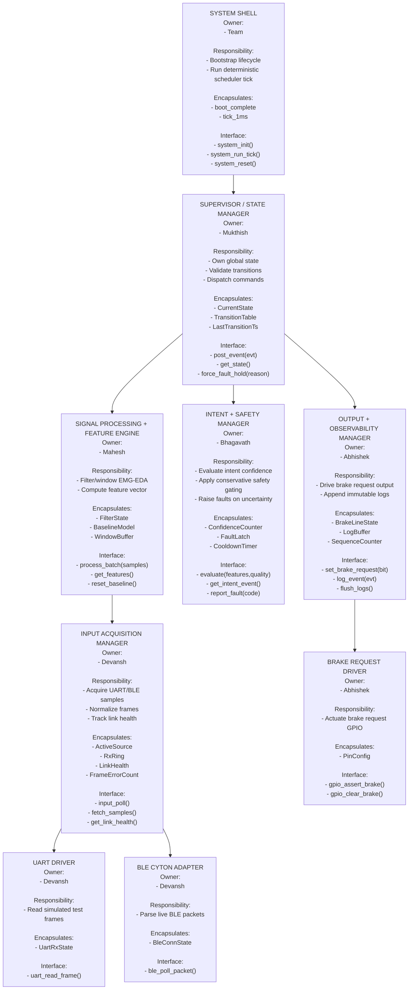

# Lab: Firmware Architecture Design
## From Behavioral Models to Structured Implementation

> **Course:** CS G523 - Software for Embedded Systems
> **Submission Type:** Group document with individual module ownership
> **Objective:** Translate behavioral models into disciplined firmware structure

---

## Purpose of This Lab

By the end of this lab, the team produces:

- A justified architectural structure
- A hierarchical control decomposition
- Explicit dependency constraints
- Module ownership and specifications
- Light structural safeguards
- Module-level test definitions

## Submission
Use the template provided [here](https://github.com/gsaurabhr-teaching/csg523-material/blob/main/labs/lab4-group-sample.md), then store the final document in the repository under `docs/sections/architecture.md`.

---

## Step 1 - Identify Software Blocks (Exploratory Sketch)

Purpose of this sketch: validate early block boundaries before formal hierarchy and dependency rules.

---

## Step 2 - Hierarchy of Control Diagram (Mermaid)

System control authority resides in: **Supervisor / State Manager**  
System state is owned by: **Supervisor / State Manager**

---

## Step 3 - Dependency Constraints

### Allowed dependency directions

- `System Shell -> Supervisor`
- `Command Interface -> Supervisor`
- `Supervisor -> Input Acquisition Manager`
- `Supervisor -> Signal Processing + Feature Engine`
- `Supervisor -> Intent + Safety Manager`
- `Supervisor -> Output + Observability Manager`
- `Input Acquisition Manager -> UART Driver / BLE Cyton Adapter`
- `Output + Observability Manager -> Brake Request Driver`
- Data flow only (no control ownership transfer):
- `Input -> Feature` via immutable sample batches
- `Feature -> Decision` via immutable feature vectors
- `Decision -> Supervisor` via events
- Logging call path is one-way append only:
- `Any module -> Output.log_event(evt)`

### Forbidden dependencies

- Drivers calling upward into application logic
- `Decision` directly writing hardware GPIO
- `Feature` directly reading UART/BLE drivers
- `Logger` or `Output` influencing state transitions
- UI bypassing Supervisor to command any internal module
- Any circular dependency

### Global state policy

- Only `Supervisor` owns `CurrentState`
- No shared mutable global variables across modules
- Configuration constants are read-only after startup

### Policy on cross-module data sharing

- Cross-module exchange must use typed immutable payloads
- No writable pointers shared across module boundaries
- Bounded ring buffers must have explicit producer/consumer ownership

---

## Step 4 - Behavioral Mapping Table

Sequence diagram identifiers used below:
- `SD-1`: Normal monitoring loop (UART path)
- `SD-2`: Emergency intent confirmation and brake request assert
- `SD-3`: Sensor fault and fail-safe transition
- `SD-4`: BLE source substitution and link recovery
- `SD-5`: Intent clear and cooldown de-assert

| Module | Related States | Related Transitions | Related Sequence Diagrams |
|--------|----------------|---------------------|---------------------------|
| System Shell | StartupSafe, Monitoring, FaultHold | BootComplete, ResetRequested | SD-1, SD-3, SD-5 |
| Supervisor / State Manager | StartupSafe, Monitoring, IntentCandidate, EmergencyRequest, FaultHold | All transitions | SD-1, SD-2, SD-3, SD-4, SD-5 |
| Input Acquisition Manager | StartupSafe, Monitoring, FaultHold | SourceSelected, FrameValid, FrameTimeout, MalformedFrameLimit | SD-1, SD-3, SD-4 |
| UART Driver | None (transport helper) | FrameRxInterrupt, UartFrameParsed | SD-1, SD-3 |
| BLE Cyton Adapter | None (transport helper) | BlePacketRx, BleLinkRecovered | SD-4 |
| Signal Processing + Feature Engine | Monitoring, IntentCandidate | WindowReady, BaselineUpdated, FeatureInvalid | SD-1, SD-2 |
| Intent + Safety Manager | Monitoring, IntentCandidate, EmergencyRequest, FaultHold | CandidateStart, CandidateConfirm, ConfidenceDrop, FaultLatched | SD-2, SD-3, SD-5 |
| Output + Observability Manager | EmergencyRequest, FaultHold | BrakeAssert, BrakeDeassert, FaultLatched | SD-2, SD-3, SD-5 |
| Brake Request Driver | None (actuator helper) | GpioAssert, GpioClear | SD-2, SD-3, SD-5 |

---

## Step 5 - Interaction Summary

| Module | Calls | Called By | Shared Data? |
|--------|-------|-----------|--------------|
| System Shell | Supervisor (`system_init`, `system_run_tick`, `system_reset`) | Platform boot/reset | No |
| Command Interface | Supervisor (`post_event`) | External operator | No |
| Supervisor / State Manager | Input, Feature, Decision, Output | System Shell, Command Interface | No |
| Input Acquisition Manager | UART Driver, BLE Cyton Adapter, Output.log_event | Supervisor | No |
| Signal Processing + Feature Engine | Output.log_event | Supervisor | No |
| Intent + Safety Manager | Output.log_event | Supervisor | No |
| Output + Observability Manager | Brake Driver | Supervisor, all modules for logging | No |
| UART Driver | None | Input Acquisition Manager | No |
| BLE Cyton Adapter | None | Input Acquisition Manager | No |
| Brake Request Driver | None | Output + Observability Manager | No |

---

## Step 6 - Architectural Rationale

### Organizational Style: Coordinated Safety Pipeline

This architecture uses a coordinated controller pattern with a deterministic data pipeline:

- `Supervisor` owns all control authority and software state.
- Acquisition, feature extraction, and decision logic are separated so UART and BLE can be swapped without changing safety logic.
- `Decision` never actuates hardware directly; all actuation passes through `Supervisor -> Output`.
- Safety behavior is conservative by design: ambiguity, stale data, or repeated frame errors produce fault events and transition to `FaultHold`.
- Logging is one-way append only, ensuring observability without affecting control behavior.

This structure is intentionally robust for safety verification: deterministic control flow, bounded interfaces, explicit ownership, and clean fault containment.

---

## Step 7 - Task Split (Team Size: 5)

| Member | Module(s) Owned |
|--------|------------------|
| Mukthish | Supervisor / State Manager |
| Devansh | Input Acquisition Manager + UART/BLE adapters |
| Mahesh | Signal Processing + Feature Engine |
| Bhagavath | Intent + Safety Manager |
| Abhishek | Output + Observability Manager + Brake Driver |

---

