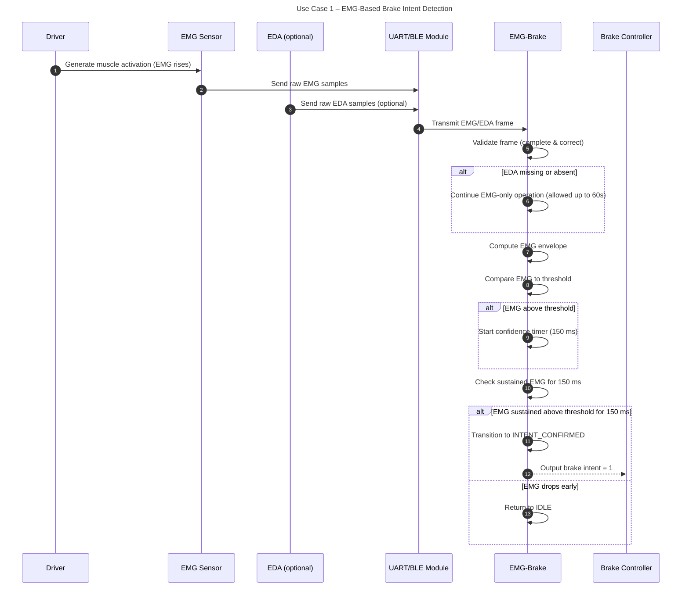
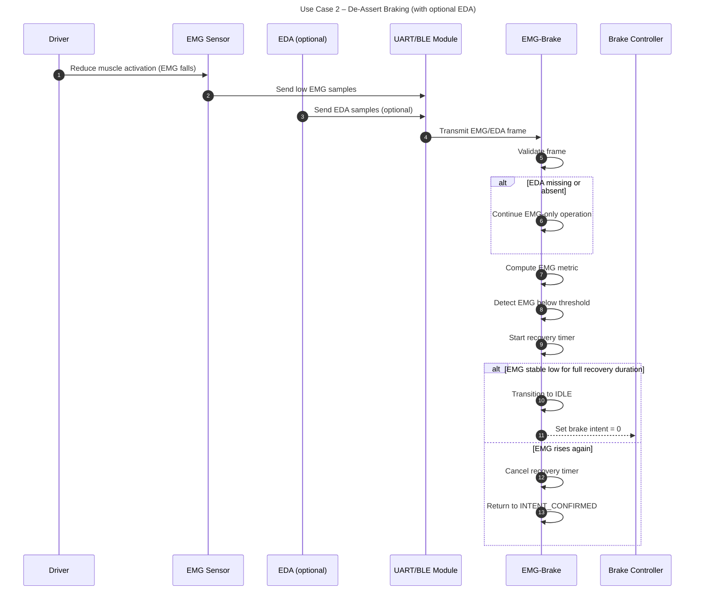
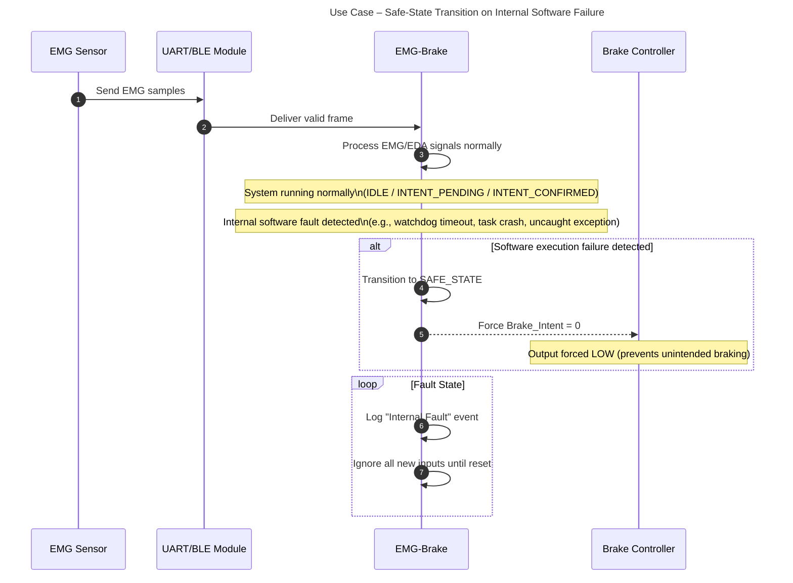
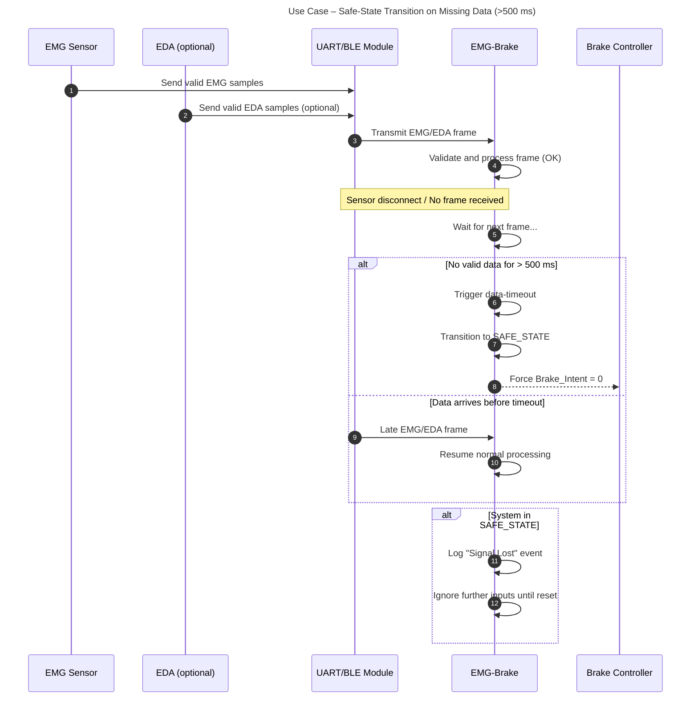

## 1. Key Sequence Diagrams

### SD-1 : EMG-Based Brake Intent Detection

---

### SD-2: De-Assert Braking (with optional EDA)

---

### SD-3: Safe-State Transition on Internal Software Failure

---

### SD-4: Safe-State Transition on Missing Data (>500 ms)

---

## 2. Traceability Matrix

| Requirement | Statechart Element(s) | Sequence Diagram(s) | Test ID |
|------------|------------------------|----------------------|---------|
| R-1 Detect Emergency Brake Intent           | Idle → IntentPending → IntentConfirmed | SD-1                | T-1     |
| R-2 De-Assert Braking                       | IntentConfirmed → Recovery → Idle      | SD-2                | T-2     |
| R-4 Safe State on Missing Data            | AnyState → SafeState                   | SD-3                | T-3     | 
| R-7 Safe State on Internal Software Failure | AnyState → SafeState                   | SD-4                | T-4     |
---

## 3. Test Plan

The tests are design-level and do not include implementation details.

### T-1: Emergency Brake Intent Detection

**Preconditions**
- System in Idle
- EMG threshold and confidence window (150 ms) configured
- UART/BLE data flow active

**Stimulus**
- Provide EMG signal above threshold for 150ms

**Test Steps**

1. Start feeding rising EMG samples > Threshold
2. Maintain EMG above threshold for 150ms
3. Observe system transition to IntentConfirmed
4. Observe brake intent output

**Observations / Measurements**

- EMG envelope value
- System state transitions
- Brake intent signal (0/1)

**Expected Outcome**

- Brake intent asserted after sustained EMG above threshold

**Pass/Fail Criteria**

- PASS if brake signal = 1 only after 150 ms
- FAIL if brake asserts early or never asserts

### T-2: De-Assert Braking

**Preconditions**

- System in IntentConfirmed
- Brake intent output = 1

**Stimulus**

- Feed EMG < Threshold for recovery period (300 ms)

**Test Steps**

1. Provide EMG below threshold
2. Hold low EMG for 300 ms
3. Observe transition to Idle
4. Observe brake intent = 0

**Observations / Measurements**

- EMG metric
- State transitions
- Brake intent signal

**Expected Outcome**

- Brake intent is cleared after 300 ms

**Pass/Fail Criteria**

- PASS if intent resets correctly
- FAIL if intent clears early or stays stuck

### T-3: Safe State on Missing Data (> 500 ms)

**Preconditions**

- System in any normal operating state
- EMG/EDA frames flowing

**Stimulus**

- Stop transmitting EMG/EDA frames

**Test Steps**

1. Interrupt sensor or UART/BLE input
2. Wait for 500 ms timeout
3. Observe transition to SafeState
4. Observe brake intent output

**Observations / Measurements**

- Data timestamps
- State transitions
- Brake intent signal

**Expected Outcome**

- SafeState must be entered immediately after timeout
- Brake intent forced to 0

**Pass/Fail Criteria**

- PASS if system becomes safe at 500 ms
- FAIL if brake stays asserted or state does not change

### T-4: Safe State on Internal Software Failure

**Preconditions**

- System running normally (any state)

**Stimulus**

- Trigger internal error (e.g., watchdog timeout, forced loop, task crash)

**Test Steps**

1. Simulate watchdog timeout or internal crash
2. Observe system response
3. Verify brake intent signal and state transition

**Observations / Measurements**

- Fault logs
- Watchdog reset flags
- Brake intent output

**Expected Outcome**

- System enters SafeState immediately
- Brake intent = 0

**Pass/Fail Criteria**

- PASS if brake intent is forced LOW and SafeState entered
- FAIL if system remains stuck or brake stays HIGH

## 4. Gap and Risk Analysis

- EMG can show high-frequency spikes unrelated to braking, which may mislead detection if filtering is weak
- Incorrect recovery timing (300 ms) can cause oscillation between states
- Improper data-freshness and timeout logic can delay transition to SafeState
- BLE/UART jitter may trigger false soft faults or unstable recovery
- Watchdog timer window may be too small/large, causing unnecessary resets or undetected lockups
- Threshold mis-tuning could cause false braking intents or missed detection
