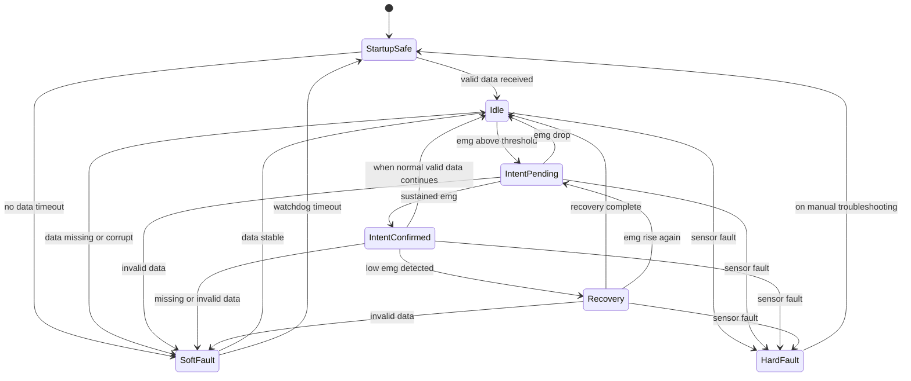

## System State Model

```mermaid
stateDiagram-v2
    [*] --> StartupSafe

    StartupSafe --> Idle : valid data received
    StartupSafe --> SoftFault : no data timeout

    Idle --> IntentPending : emg above threshold
    Idle --> SoftFault : data missing or corrupt
    Idle --> HardFault : sensor fault

    IntentPending --> IntentConfirmed : sustained emg
    IntentPending --> Idle : emg drop
    IntentPending --> SoftFault : invalid data
    IntentPending --> HardFault : sensor fault

    IntentConfirmed --> Recovery : low emg detected
    IntentConfirmed --> HardFault : sensor fault
    IntentConfirmed --> Idle : when normal valid data continues
    IntentConfirmed --> SoftFault : missing or invalid data

    Recovery --> Idle : recovery complete
    Recovery --> IntentPending : emg rise again
    Recovery --> SoftFault : invalid data
    Recovery --> HardFault : sensor fault

    SoftFault --> Idle : data stable
    SoftFault --> StartupSafe : watchdog timeout

    HardFault --> StartupSafe : on manual troubleshooting
```
